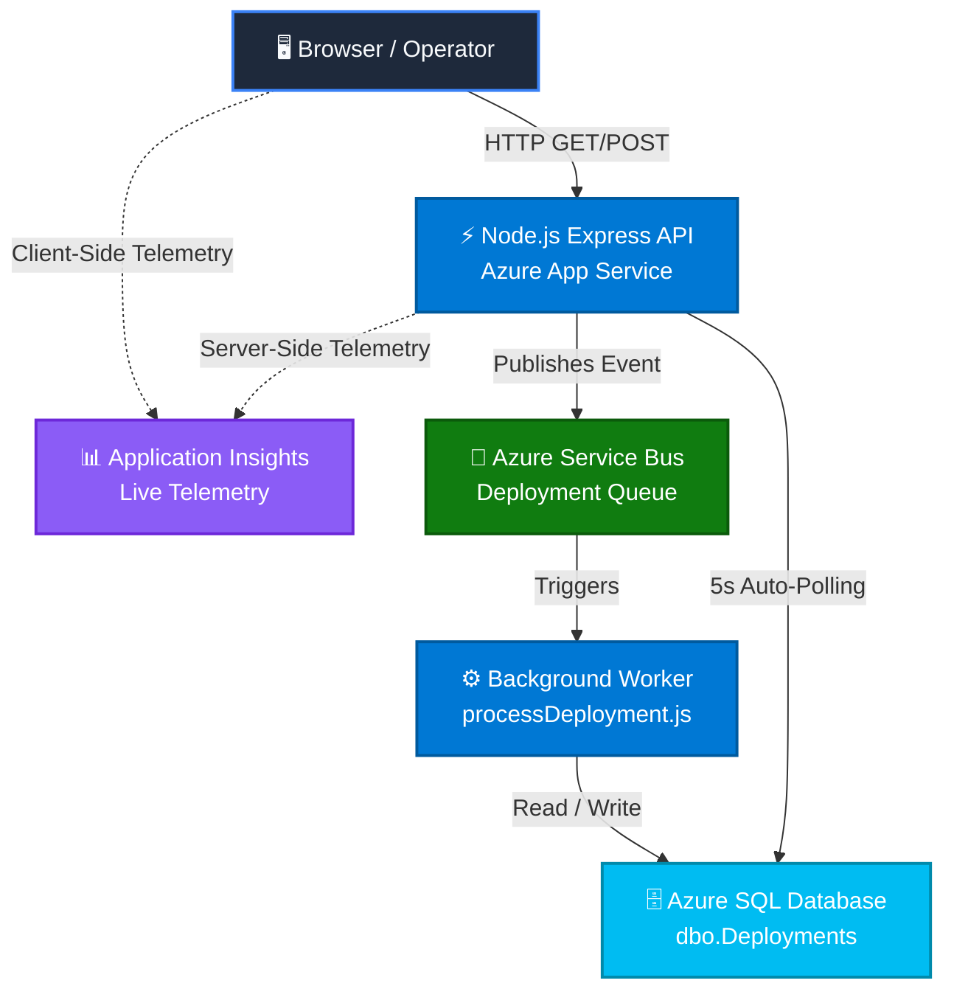

#  AzureOps Portal

[](https://github.com/actions)
[](https://nodejs.org)
[](https://azure.microsoft.com/)
[](https://azure.microsoft.com/)
[](https://opensource.org/licenses/MIT)

AzureOps is a highly engineered, production-ready cloud administration portal designed for zero-latency deployment tracking and real-time infrastructure telemetry. Built with a modern Node.js/Express backend and a geometric, high-density frontend, it provides operators with instant operational awareness without the overhead of heavy SPA frameworks.

---

##  Key Features

*   **Real-Time Telemetry Sparklines:** Hardware-accelerated, rolling-window visualizations for CPU and Memory utilization.
*   **Vertical Audit Timeline:** Chronological deployment history with relative time formatting, graceful empty states, and dynamic status nodes.
*   **Geometric Environment Grid:** Responsive CSS-grid architecture featuring stenciled typography and visual status indicators (Active/Decommissioned).
*   **Enterprise Security:** Hardened Express backend with automated rate-limiting (`express-rate-limit`) and HTTP security headers (`helmet`).
*   **Global Client Telemetry:** Native Azure Application Insights integration mapping front-end performance and user traffic.
*   **Dual-Deployment Strategy:** CI/CD pipelines configured for both raw App Service code deployments (speed) and Docker containerization (portability).

---

##  System Architecture

The portal leverages an event-driven, decoupled microservices architecture utilizing Azure Service Bus for reliable background task processing.



---

##  Tech Stack

| Domain | Technology | Purpose |
| --- | --- | --- |
| **Frontend** | HTML5, CSS3, Vanilla JS | High-density, zero-dependency geometric UI |
| **Data Viz** | Chart.js | Hardware telemetry sparklines |
| **Backend** | Node.js, Express.js | High-throughput REST API |
| **Database** | Azure SQL | Relational state and audit logs |
| **Messaging** | Azure Service Bus | Decoupled deployment queue |
| **DevOps** | GitHub Actions (OIDC) | Automated CI/CD pipelines |
| **Observability** | Azure Application Insights | Full-stack performance monitoring |

---

##  Getting Started

### Prerequisites

* Node.js v20+
* An active Azure Subscription (App Service, SQL, Service Bus)
* Git

### Local Installation

1. **Clone the repository**
```bash
git clone [https://github.com/your-username/AzureOps.git](https://github.com/your-username/AzureOps.git)
cd AzureOps

```


2. **Install dependencies**
```bash
cd app
npm install

```


3. **Configure Environment Variables**
Create a `.env` file in the root of the `app` directory and populate it with your Azure connection strings:
```env
PORT=3000
AZURE_SQL_CONNECTION_STRING="Server=tcp:your-server.database.windows.net,1433;Database=your-db;..."
SERVICE_BUS_CONNECTION_STRING="Endpoint=sb://your-namespace.servicebus.windows.net/;..."
APPINSIGHTS_INSTRUMENTATIONKEY="your-instrumentation-key"

```


4. **Run the development server**
```bash
npm run dev

```


The portal will be available at `http://localhost:3000`.

---

##  Deployment Strategy

This repository supports two parallel deployment models via GitHub Actions:

1. **App Service (Code Deployment):** Optimized for speed and rapid iteration. Pushes raw Node.js files directly to Azure's managed runtime.
2. **Container Apps (Docker):** Optimized for enterprise portability and immutability. Builds a sterile Linux container image pushed to Azure Container Registry (ACR).

All workflows are secured via **OIDC (OpenID Connect)**, completely eliminating the need for long-lived static credentials or secrets.

---

##  Security Posture

* **Rate Limiting:** Enforced at the Express router level (Max 100 requests / 15 minutes per IP).
* **HTTP Headers:** Strict Cross-Origin Resource Sharing (CORS) and content policies managed via `helmet`.
* **Authentication:** Infrastructure supports zero-code enterprise single sign-on (SSO) via Microsoft Entra ID (Azure EasyAuth).

---